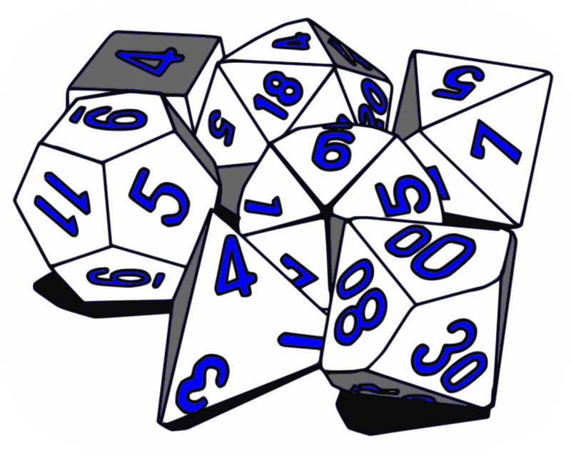
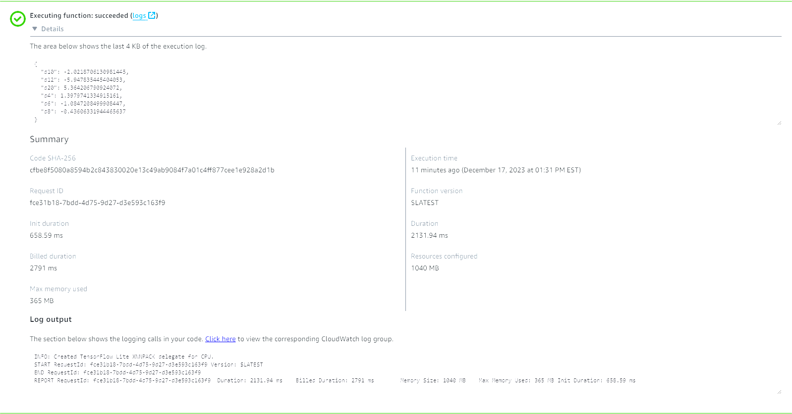
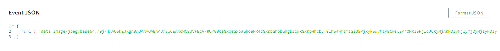

# Capstone 1 - Dice Image Identifier 

## Description

This project builds a deep learning computer vision model that aims to identify the standard dice you would see in an RPG game such as Dungeons and Dragons. There are 6 different types of dice a D4, D6, D8, D10, D12, and D20 where the number indicates the number of sides. A standard dice kit will have 7 dice as there are 2 different D10, one for the 10s position and oen for the 1s position. 

The project aims to help new RPG players who are playing online. Tabletop RPG games such as Dungeons and Dragons have seen an increase in popularity recently with many players opting to play online. RPG games can be very confusing and using the right dice at the right time is hard for players to pull off. This project will allow a Dungeon/Game Master to identify if the correct dice was rolled.

Future improvements would include being able to recognize multiple different dice in the same image as well as identifying the numbers on the dice.



## EDA and Data preparation

All exploratory data analysis and data preparation are done in my notebook [eda.ipynb](eda.ipynb)

Data source: https://www.kaggle.com/datasets/ucffool/dice-d4-d6-d8-d10-d12-d20-images  
I was able to find an image dataset I needed on kaggle. 

During my EDA in the notebook above I found there were 1. image size outliers and 2. imbalanced classes. Those were corrected for and the images were split into train/test/val sets.

## Model Building and Deployment

All model building and deployment are done/explained in my notebook [model.ipynb](model.ipynb)

For the base neural network model I decided on the Keras pretrained Xception model due to it's high accuracy and somehwat low depth required.  
* While this model was pretrained, because my images were 480x480, I used transfer learning to account for this
* More layers were added including ReLu inner layer 
* Due to the very high accuracy and adequate number of training images it was not necessary to add additional transformations via `ImageDataGenerator`

Ending tuned parameters:
* `learning_rate` = 0.001
* `size` = 100
* `droprate` = 0.2

Upon training and tuning the initial model [model.ipynb](model.ipynb), checkpointing was used to convert the checkpoint file into a keras model. The keras model was converted to tflite [dice-model.tflite](dice-model.tflite) and finally the code was converted from ipynb to py format [lambda_function.py](lambda_function.py) in order to prepare for containerization.

The model was containerized via Docker as can be seen in the [Dockerfile](Dockerfile).

If you would like to run local tests on your container feel free to use the test file [test.py](test.py).

The container was hosted on AWS ECR and an AWS Lambda Function was created with the ECR image.  

## Testing Deployed Model

Feel free to test the model with any URL of a single dice image via the Lambda URL:  
https://uowy47amzmpbhrc4ypgkmtbetu0qtoxw.lambda-url.us-east-2.on.aws/

I will keep this open for at least a couple weeks after 12/18/2023 project due date as long as there is no substantial cost.

The function accepts the following format:
```json
{
    "url":"put_your_image_url_here.com"
}
```

Here is an image of me running a test:





I went to google images and types "rpg d20 dice" and picked a random image of a single dice. The image URL is what is used to pass via the url parameter for the Lambda Function.